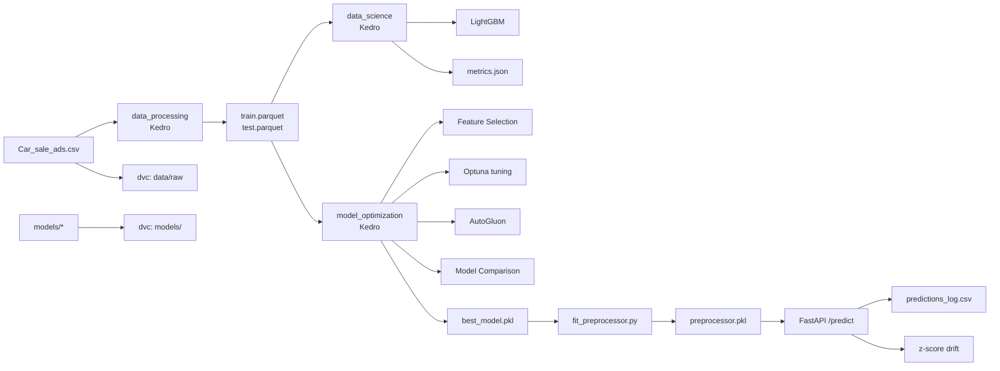

# ASI Car Price
Autorzy: s27664, s28166

## Cel projektu
Predykcja ceny samochodu na podstawie ogłoszeń. Target: Log_Price.

## Wymagania

### Narzędzia
- **Docker** + **Docker Compose** — do uruchomienia kontenera (zalecane)
- Python 3.11 — do pracy lokalnej bez Dockera

### Pliki — gdzie wrzucić

Aby `docker-compose up --build` zadziałało, te pliki muszą być na swoim miejscu:

| Plik | Ścieżka | Wymagany | Opis |
|------|---------|----------|------|
| `Car_sale_ads.csv` | `data/raw/Car_sale_ads.csv` | ✅ tak | Surowe ogłoszenia (165 MB) |
| `best_model.pkl` | `models/best_model.pkl` | ✅ tak | Wytrenowany model LightGBM |
| `preprocessor.pkl` | `models/preprocessor.pkl` | ✅ tak | Preprocessor dopasowany do danych |
| `selected_feature_columns.joblib` | `models/selected_feature_columns.joblib` | ❌ opcjonalny | Lista wybranych cech po feature selection |
| `lgbm_model.pkl` | `models/lgbm_model.pkl` | ❌ opcjonalny | Model z domyślnego pipeline'u Kedro |

> ⚠️ **Uwaga**: `data/raw/`, `data/processed/`, `data/05_model_input/` i `models/` są montowane jako **wolumeny** z hosta do kontenera. Nie musisz rebuildować obrazu przy zmianie danych czy modeli.

## Architektura



## Struktura

```
asi-car-price/
├── api/                    # FastAPI
│   ├── main.py             # /health, /predict, /drift, /predictions
│   ├── preprocessing.py    # InferencePreprocessor
│   ├── schemas.py          # Pydantic modele
│   └── monitoring.py       # logowanie + drift
├── conf/base/              # Kedro config
│   ├── catalog.yml         # dataset registry
│   └── parameters.yml      # parametry pipeline'u
├── data/
│   ├── raw/                # oryginalny CSV (DVC)
│   ├── processed/          # train/test parquet (DVC)
│   └── 05_model_input/     # X/y pickle (DVC)
├── models/                 # .pkl, .joblib (DVC)
├── scripts/
│   └── fit_preprocessor.py # dopasowanie preprocessora
├── src/
│   ├── car_price/          # Kedro pipelines
│   │   └── pipelines/
│   │       ├── data_processing/   # preprocessing
│   │       ├── data_science/      # trenowanie
│   │       └── model_optimization/# Optuna, AutoGluon
│   ├── features/           # feature engineering
│   ├── models/             # tuning, automl
│   ├── preprocessing/      # czyszczenie
│   ├── evaluation/         # metryki
│   └── tracking/           # MLflow utils
├── tests/
├── reports/                # metrics, params, comparison
├── Dockerfile
├── .github/workflows/ci.yml
└── wymagania.pdf
```

## Szybki start

```bash
py -3.11 -m venv .venv
.venv\Scripts\activate
pip install -r requirements.txt
pip install -e .
```

Dane: `data/raw/Car_sale_ads.csv`

### Pipeline bazowy
```bash
kedro run                          # data_processing + data_science
```

`data_processing`: czyszczenie (outliers, EUR, doors), dodanie log_price, Brand_Model, lista cech, podział train/test, target encoding.  
`data_science`: trenowanie LightGBM, ewaluacja (R²_log, MAE_PLN, RMSE_PLN), MLflow log.

### Pipeline optymalizacji
```bash
kedro run --pipeline model_optimization  # ~8 minut
```

1. AutoGluon (ensemble modeli)
2. Feature selection (LightGBM importance, top 50)
3. Optuna hyperparameter tuning (30 triali, 3-fold CV)
4. Porównanie Ridge vs HistGBR vs LightGBM default vs LightGBM tuned
5. Wybór najlepszego modelu → `models/best_model.pkl`

### API
```bash
python scripts/fit_preprocessor.py       # dopasowanie preprocessora
uvicorn api.main:app --reload            # http://localhost:8000
```

## API

| Metoda | Ścieżka | Opis |
|--------|---------|------|
| GET | /health | Status |
| POST | /predict | Predykcja ceny |
| GET | /predictions | Historia |
| GET | /drift | Dryf danych |

### Przykład

```bash
curl -X POST http://localhost:8000/predict -H "Content-Type: application/json" -d '{"vehicle_brand":"BMW","vehicle_model":"X5","production_year":2020,"mileage_km":50000,"power_hp":300,"fuel_type":"Diesel","type":"SUV","features":["ABS"]}'
```

## Docker

### Szybki start (docker-compose — zalecane)

Uruchamia API natychmiast, używając gotowych modeli z hosta:

```bash
docker-compose up --build
```

Wolumeny montują `data/`, `models/` i `reports/` z hosta, więc obraz pozostaje lekki.

> **Przygotowanie plików**: Przed pierwszym uruchomieniem upewnij się, że masz dane i modele na swoich ścieżkach (patrz [Wymagania](#wymagania)). Możesz je pobrać przez DVC:
> ```bash
> dvc pull
> ```
> lub wytrenować od zera poleceniami z sekcji [Retrenowanie](#retrenowanie-w-kontenerze).

### Retrenowanie w kontenerze

```bash
docker-compose exec api kedro run
docker-compose exec api python scripts/fit_preprocessor.py
```

### Standalone (pełny pipeline przy starcie)

```bash
docker build -t asi-car-price-api .
docker run -p 8000:8000 asi-car-price-api
```

Uwaga: `docker run` uruchamia `kedro run` + `fit_preprocessor.py` przed API — może to potrwać kilkanaście minut.

## DVC

Wersjonowanie danych i modeli:

```bash
dvc pull                    # pobranie danych
dvc checkout                # przywrócenie wersji
dvc push                    # wysłanie do storage
dvc status                  # sprawdzenie zmian
```

DVC remote (lokalny): `/tmp/dvc-storage`. Dla produkcji zmień na S3/GDrive/SSH.

## CI/CD

GitHub Actions (`.github/workflows/ci.yml`) uruchamia testy przy każdym pushu/PR na main.

## Wyniki

| Model | R²_log | MAE_PLN | RMSE_PLN |
|-------|-------:|--------:|---------:|
| AutoGluon | 0.956 | 6 940 | 15 791 |
| LightGBM tuned | 0.953 | 7 342 | 16 698 |
| LightGBM default | 0.950 | 7 991 | 17 886 |
| HistGBR | 0.941 | 9 351 | 20 635 |
| Ridge | 0.811 | 16 792 | 34 238 |
